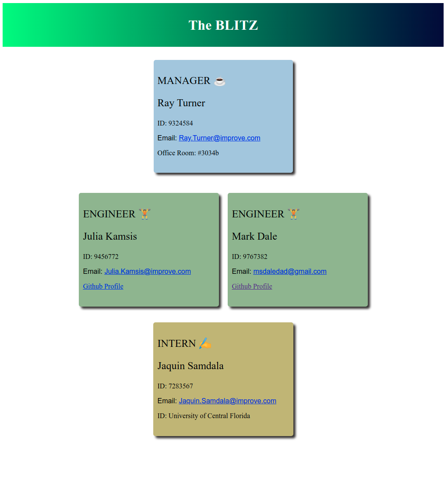

# team-profile-generator

## Description

The Team Profile Generator generates a styled HTML page that displays summary information about a software development team and it's members, while also providing access to the individual member Github profiles.

## Table Of Contents

* [Installation](#installation)
* [Usage](#usage)
* [Tests](#tests)

## Installation

It is assumed the local computing environment already has a recent version of node and npm installed.  If not please check out https://nodejs.org/en/download/ and install node and npm.  To run this node application, clone this github repository using the command 'git clone https://github.com/msdale/team-profile-generator.git <optional_root_directory_name>'.  Attach to the team-profile-generator root directory and execute the commands 'npm install', 'npm install fs-extra' and 'npm install inquirer' to ensure all project module dependencies are availablel and updated.  Now you are ready to run the team profile generator.

npm-updates.mp4

## Usage

To execute the application, from the command line, attach to the root directory of the team profile generator repository clone and run the command 'node index.js'.  This will walk the user through a series of questions.  Here is an example of the question series when the user enters information for a team consisting of a Manager, two Engineer's and an Intern...

? What is your Team name? (Required) The BLITZ  
? What is the Manager's name? (Required) Ray Turner  
? What is the Manager's employee ID? (Required) 9324584  
? What is the Manager's email? (Required) Ray.Turner@improve.com  
? What is the Manager's office number? (Required) 3034b  
? Would you like to add members to the Team? Yes  
? Choose an engineer or an intern: engineer  
? What is the Engineer's name? (Required) Julia Kamsis  
? What is the Engineers's employee ID? (Required) 9456772  
? What is the Engineers's email? (Required) Julia.Kamsis@improve.com  
? What is the Engineers's Github username? (Required) jkamsis  
? Would you like to add more members to the Team? Yes  
? Choose an engineer or an intern: engineer  
? What is the Engineer's name? (Required) Mark Dale  
? What is the Engineers's employee ID? (Required) 9767382  
? What is the Engineers's email? (Required) msdaledad@gmail.com  
? What is the Engineers's Github username? (Required) msdale  
? Would you like to add more members to the Team? Yes  
? Choose an engineer or an intern: intern  
? What is the Intern's name? (Required) Jaquin Samdala  
? What is the Intern's employee ID? (Required) 7283567  
? What is the Intern's email? (Required) Jaquin.Samdala@improve.com  
? What is the Intern's college name? (Required) University of Central Florida  
? Would you like to add more members to the Team? No  
{ ok: true, message: 'HTML file created!' }  
{ ok: true, message: 'CSS file copied!' }  

See demo of command-line prompts:  
question-prompts.mp4

NOTE: the 2 messages at the end of the prompts indicate the HTML and CSS files are created/copied and ready to go.  They are located in the ./dist directory and are named index.html and style.css. View the HTML file with you IDE app or your browser.  The results should appear as below.

team-profile-page.mp4

## Tests

Used Jest to unit test the four primary class objects; Employee, Manager, Engineer and Intern.  From the root directory execute the following tests:  

* npm run test Employee
* npm run test Manager
* npm run test Engineer
* npm run test Intern
  
Watch this demo to see it done.  

passing-tests.mp4

## Questions

Any questions, please contact Mark Dale.

My email address is: msdaledad@gmail.com
My github profile is https://github.com/msdale
The pertinent github repository is https://github.com/msdale/team-profile-generator